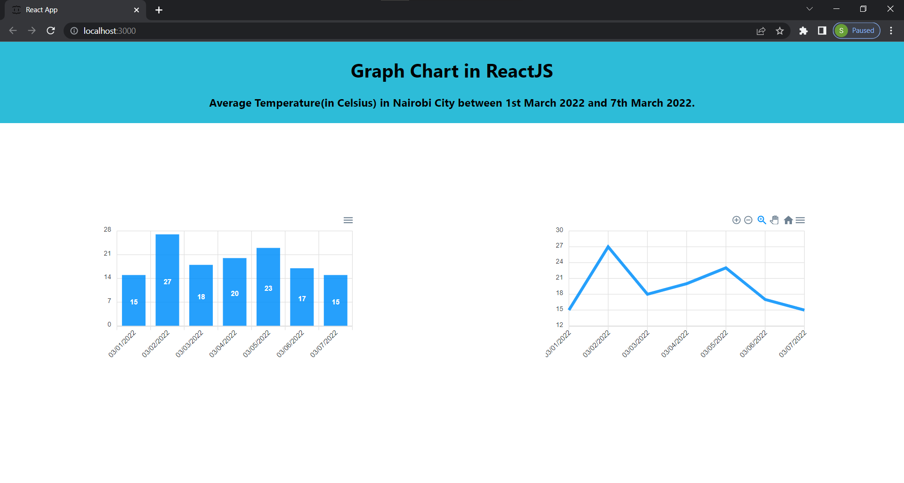

# Graph Chart in ReactJS

A dynamic and user friendly Graph Chart App built with React.js and ApexCharts.js that allows users to visualize the data by providing a REST API.  This documentation will cover how to install it in your React application and use it to visualize data from an API endpoint.
ApexCharts.js is a library that is used to visualize data. It provides features such as annotations, responsiveness, and animations that make your charts interactive. It can be used with other frameworks such as Vue and Angular.

## Getting Started

I have used a JSON server to create a fake REST API that we will consume in our application.
To create a dummy REST API, install the json-server library using the following command in your terminal. 

npm install -g json-server

Next, I created a functional component MyGraphs as shown in graphs.js.

## Creating fake REST API using JSON server

This file contains dummy data about the average temperature (in degrees Celsius) in Nairobi City between 1st March 2022 and 7th March 2022.

Open another terminal and run the following command to start the server.

json-server --watch data/db.json --port 8000

The command above starts our JSON server on port 8000. I have specified a port number because when you run the JSON server, it will try to run on port 3000, but we are already using this port to run our React application.
Finally, import the MyGraphs component into App.js. If you run the project on localhost:3000, below is an image of what will be on the browser.

